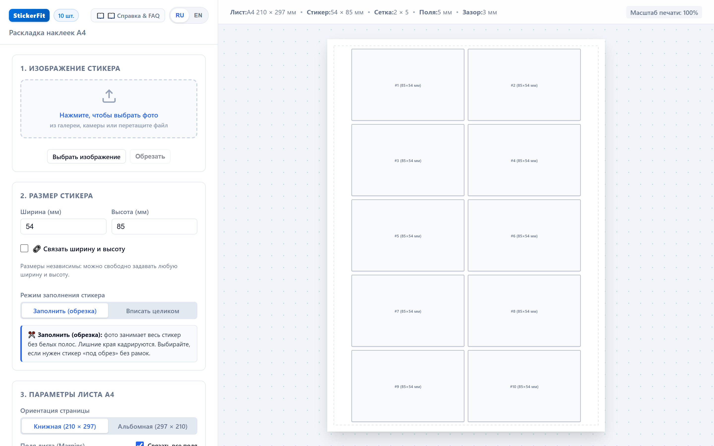
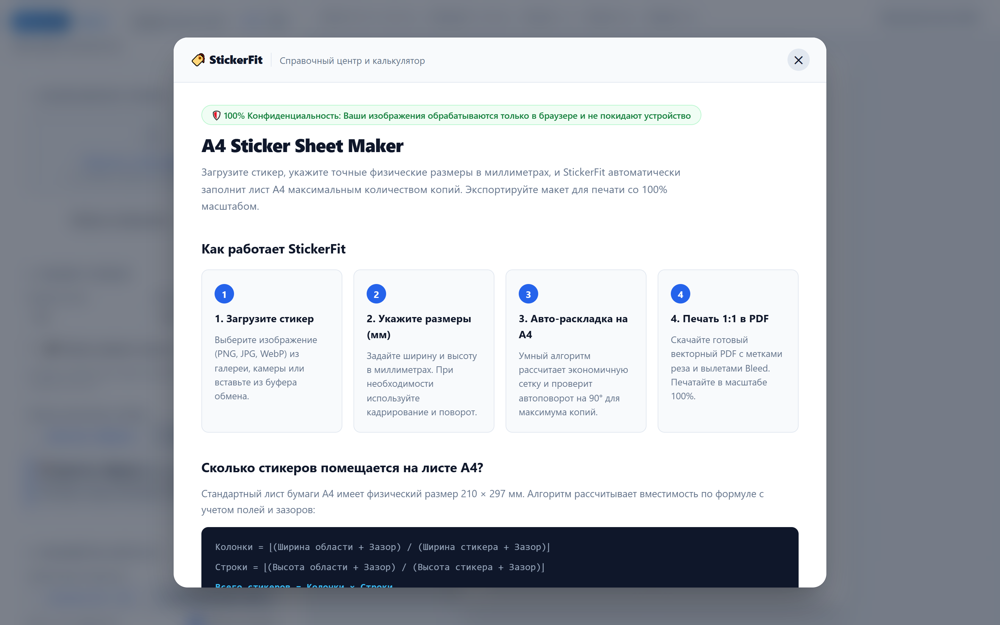

# 🏷️ StickerFit — A4 Sticker Sheet Maker & Generator

<div align="center">

**Auto-layout & print custom stickers on A4 sheets with exact millimeter precision.**  
*Автоматическая верстка и подготовка к печати стикеров на листах A4 с физической точностью в миллиметрах.*

[](https://stickerfit.vercel.app)
[](https://stickerfit.netlify.app/)
[](https://sefga.github.io/stickerfit/)
[](https://stickerfit.vercel.app)
[](https://github.com/sefga/stickerfit)
[](./LICENSE)

**[ 🚀 Try Online / Открыть сервис ](https://stickerfit.vercel.app)** &nbsp;•&nbsp; **[ 🇬🇧 English Overview ](#-english-overview)** &nbsp;•&nbsp; **[ 🇷🇺 Русская документация ](#-русская-документация)** &nbsp;•&nbsp; **[ 📐 Точность печати (1:1) ](docs/PRINT_ACCURACY.md)**

</div>

---

## ⚡ 15-Second Workflow / 3 простых шага к готовой печати

```text
  [ 1. Загрузите стикер ]       →    [ 2. Укажите размер (мм) ]    →    [ 3. Скачайте векторный PDF ]
PNG, JPEG, WebP (в браузере)          Ширина × Высота (0.1 мм)            1:1 MediaBox, Bleed, Cut Marks
                                      Автоповорот 90° для экономии         Готово за 30–60 секунд!
```

---

## 📸 Интерфейс приложения / Interface Preview

### 💻 Desktop Experience (1440 × 900)
> Интерактивный предпросмотр листа A4 в реальном масштабе, расчет максимальной вместимости, параметров сетки и качества DPI.

<div align="center">
  
</div>

<br />

<div align="center">
  <table>
    <tr>
      <td width="33%" align="center">
        <b>📱 Мобильный интерфейс (Touch)</b><br />
        <i>Адаптивные вкладки и цифровые клавиатуры</i><br /><br />
        
      </td>
      <td width="33%" align="center">
        <b>⚙️ Интуитивные параметры</b><br />
        <i>Связывание сторон 🔗 и режимы Заполнить/Вписать</i><br /><br />
        
      </td>
      <td width="33%" align="center">
        <b>📖 Справочный центр & Калькулятор</b><br />
        <i>Apple Help Sheet с FAQ и калькулятором</i><br /><br />
        
      </td>
    </tr>
  </table>
</div>

---

## 🌐 Доступ к онлайн-версии / Live Deployments

| Платформа | Домен | Скорость | Назначение |
|:---|:---|:---:|:---|
| **Vercel (Production)** | [stickerfit.vercel.app](https://stickerfit.vercel.app) | ⚡ Fast | Основной канонический домен (Global Anycast CDN) |
| **Netlify (Mirror)** | [stickerfit.netlify.app](https://stickerfit.netlify.app/) | ⚡ Fast | Зеркало на глобальной инфраструктуре Netlify Edge |
| **GitHub Pages** | [sefga.github.io/stickerfit](https://sefga.github.io/stickerfit/) | ⚡ Fast | Официальное открытое зеркало проекта |

---

## 🇬🇧 English Overview

### What is StickerFit?
**StickerFit** is a high-performance, 100% client-side web application designed to automatically arrange stickers, labels, and decals onto an A4 paper sheet for physical printing. It calculates the maximum possible sheet capacity, optimizes layout with 90° auto-rotation, and exports a print-ready 1:1 scale vector PDF with cut marks and bleed.

### Key Highlights
- 🛡️ **100% Client-Side Privacy**: Your artwork and pictures never leave your browser. Zero server uploads. Client-side processing with minimal, cookie-free anonymous analytics (counting pageviews and exports).
- 📏 **Exact Millimeter Precision**: Enter exact sticker dimensions ($W \times H$ mm), margins, and gaps with 0.1 mm step.
- 📐 **Intelligent Auto-Rotation (90°)**: Automatically tests both orientations and chooses whichever packs more stickers onto the sheet.
- ✂️ **Fill (Crop) vs Fit (Whole)**:
  - **Fill (Crop edges)**: Artwork covers 100% of the sticker area with zero white borders.
  - **Fit (Whole image)**: Entire image remains 100% visible with no cropped details.
- 🔗 **Optional Proportional Linking**: Freely enter custom dimensions ($70 \times 40$ mm) or lock proportions with a single toggle.
- 🔍 **Real DPI Quality Indicator**: Automatically detects effective print resolution ($\ge 300\text{ DPI}$ green, $200\text{--}299\text{ DPI}$ good, $<150\text{ DPI}$ warning).
- 📄 **1:1 Scale Print-Ready PDF**: Powered by `pdf-lib` with exact A4 MediaBox ($595.28 \times 841.89\text{ pt}$), vector cut marks, bleed margins (0..3 mm), and a built-in printer calibration ruler sheet.
- 📱 **Mobile & Desktop First (Apple HIG)**: Touch targets $\ge 42$ px, native decimal keyboards, 60 FPS typing with zero long tasks.

### 📐 Physical Print Accuracy
Read our comprehensive guide: **[docs/PRINT_ACCURACY.md](docs/PRINT_ACCURACY.md)** to ensure your printer driver does not shrink your layout with "Fit to printable area".

---

## 🇷🇺 Русская документация

### О проекте
**StickerFit** — онлайн-генератор раскладки наклеек на листе формата A4. Сервис решает главную проблему полиграфии: как быстро и без Photoshop разложить стикеры нужного размера на лист A4, получить максимальный тираж и сразу отправить на печать или скачать файл для типографии.

### Главные преимущества
1. **Конфиденциальность 100%**: Вся обработка графики и генерация PDF происходит локально в вашем браузере. Ваши файлы никогда не отправляются на удаленный сервер.
2. **Точные размеры в мм**: Задавайте ширину и высоту в миллиметрах (например, стандартные $54 \times 85$ мм для визиток или $50 \times 50$ мм для круглых стикеров).
3. **Умный расчет экономии бумаги**:
   - Автоматический расчет сетки (колонки × строки).
   - Автоповорот на 90°, если так на лист поместится больше наклеек.
   - Ограничение тиража (режим `AUTO` для максимума или конкретное число копий).
4. **Понятная настройка кадрирования**:
   - **«Заполнить (обрезка)»** — стикер заполнен целиком без белых полей по краям.
   - **«Вписать целиком»** — изображение видно на 100% без обрезки важных надписей и логотипов.
5. **Защита от ошибок ввода**:
   - Мгновенное инлайн-предупреждение, если размер превышает габариты листа A4 (например, $> 297$ мм или 304 мм).
   - Защита от зависания при случайном вводе микро-чисел.
6. **Полиграфическая подготовка**:
   - Тонкие векторные метки реза (Cut marks) под линейку.
   - Вылеты под обрез (Bleed 0, 1, 2, 3 мм).
   - Встроенный калибровочный лист A4 с контрольными квадратами $50 \times 50$ мм и $100 \times 100$ мм, эталонной линией 100 мм и миллиметровой линейкой.

### Памятка для идеальной печати
> ⚠️ **Важно:** При печати из любого просмотрщика PDF или браузера всегда выбирайте параметр масштаба **«100%»** или **«Реальный размер» (Actual size)**. Не выбирайте «По размеру страницы» (Fit to page), иначе принтер уменьшит ваши наклейки на 3–5%! Подробности в [docs/PRINT_ACCURACY.md](docs/PRINT_ACCURACY.md).

---

## 📚 Документация и стандарты проекта

| Документ | Назначение |
|:---|:---|
| **[docs/PRINT_ACCURACY.md](docs/PRINT_ACCURACY.md)** | Руководство по физической точности печати и калибровке принтера линейкой |
| **[docs/PRODUCT_LAUNCH_AUDIT.md](docs/PRODUCT_LAUNCH_AUDIT.md)** | Карта архитектуры, аудит baseline и классификация задач P0/P1/P2 |
| **[docs/SEO_STRATEGY.md](docs/SEO_STRATEGY.md)** | Стратегия честного поискового продвижения и AI Discoverability (GEO) |
| **[docs/MONETIZATION_HYPOTHESES.md](docs/MONETIZATION_HYPOTHESES.md)** | Бэклог гипотез H1–H6 (0 платного кода до подтверждения спроса) |
| **[CONTRIBUTING.md](CONTRIBUTING.md)** | Инструкция для участников разработки (Setup, тесты, PR) |
| **[SECURITY.md](SECURITY.md)** | Политика безопасности и модель защиты пользовательских данных |
| **[LICENSE](LICENSE)** | Полный текст лицензии MIT |

---

## 🚀 Быстрый старт для разработчиков (Quick Start)

### Требования
- Node.js $\ge 18.0.0$
- Любой современный браузер (Chrome, Safari, Edge, Firefox)

### 1. Клонирование и установка
```bash
git clone https://github.com/sefga/stickerfit.git
cd stickerfit
npm install
```

### 2. Запуск локального сервера разработки
```bash
npm run dev
```
Приложение будет доступно по адресу `http://localhost:3000`.

### 3. Запуск тестов
```bash
npm test
```
*Запускает 33 комплексных теста Vitest: физическую геометрию MediaBox, размеры 10–100 мм, нулевой дрейф сетки, краевые случаи и локализацию.*

### 4. Комплексный цикл оценки качества
```bash
npm run eval
```
*Выполняет полный аудит качества:*
1. Юнит- и регрессионные тесты Vitest (33/33);
2. Проверка типов TypeScript (`tsc`);
3. Production-сборка Vite (`vite build`);
4. Браузерный дизайн-критик Apple HIG (**100 / 100**);
5. Аудит задержек ввода и Core Web Vitals (**5 / 5**);
6. 5-цикличный аудит UX и локализации (**100 / 100 во всех 5 циклах**);
7. 10-агентный цикл критики персоналий (**>= 95 во всех контекстах**).

---

## 📁 Структура проекта / Architecture

```text
stickerfit/
├── .github/ISSUE_TEMPLATE/  # Шаблоны багов, фич и точности печати
├── docs/
│   ├── screenshots/         # Официальные скриншоты для витрины GitHub
│   ├── PRINT_ACCURACY.md    # Руководство по физической точности печати
│   ├── PRODUCT_LAUNCH_AUDIT.md # Аудит готовности к публичному запуску
│   ├── SEO_STRATEGY.md      # Поисковая и AI-стратегия (GEO)
│   └── MONETIZATION_HYPOTHESES.md # Исследовательский бэклог монетизации
├── public/                  # robots.txt, sitemap.xml, og-image.svg
├── scripts/                 # Автономные браузерные критики качества (Puppeteer)
│   ├── apple-design-critic.mjs   # Аудит дизайна по стандартам Apple HIG
│   ├── critic-5-cycles.mjs       # 5 независимых циклов проверки UX и валидации
│   ├── performance-critic.mjs    # Тесты скорости ввода и Core Web Vitals
│   ├── multi-persona-critic.mjs  # 10 независимых критиков персоналий
│   └── capture-readme-screenshots.mjs # Автозахват снимков экрана
├── src/
│   ├── image/               # Загрузка фото, кадрирование в исходном DPI
│   ├── layout/              # Чистая математическая модель раскладки (Layout Engine)
│   ├── pdf/                 # Векторный генератор PDF 1:1, метки реза, калибровка
│   ├── preview/             # Быстрый SVG-рендерер листа A4
│   ├── ui/                  # Умный диспетчер ввода, контроллеры и модалки
│   ├── analytics.ts         # Анонимная аналитика @vercel/analytics
│   ├── i18n.ts              # Двуязычная локализация (RU / EN)
│   ├── state.ts             # Реактивное хранилище состояния и LocalStorage
│   └── styles.css           # Apple HIG дизайн-система
├── tests/
│   └── printCorrectness.test.ts # 18 комплексных тестов физической геометрии
├── CONTRIBUTING.md           # Руководство для контрибьюторов
├── LICENSE                   # Лицензия MIT (Copyright 2026 Mikhail Sokolskiy)
├── SECURITY.md               # Политика безопасности
└── package.json
```

---

## 📜 Лицензия / License

Проект распространяется под свободной лицензией **[MIT License](LICENSE)**.  
Автор: **Михаил Сокольский ([@sefga](https://github.com/sefga))**, 2026.
