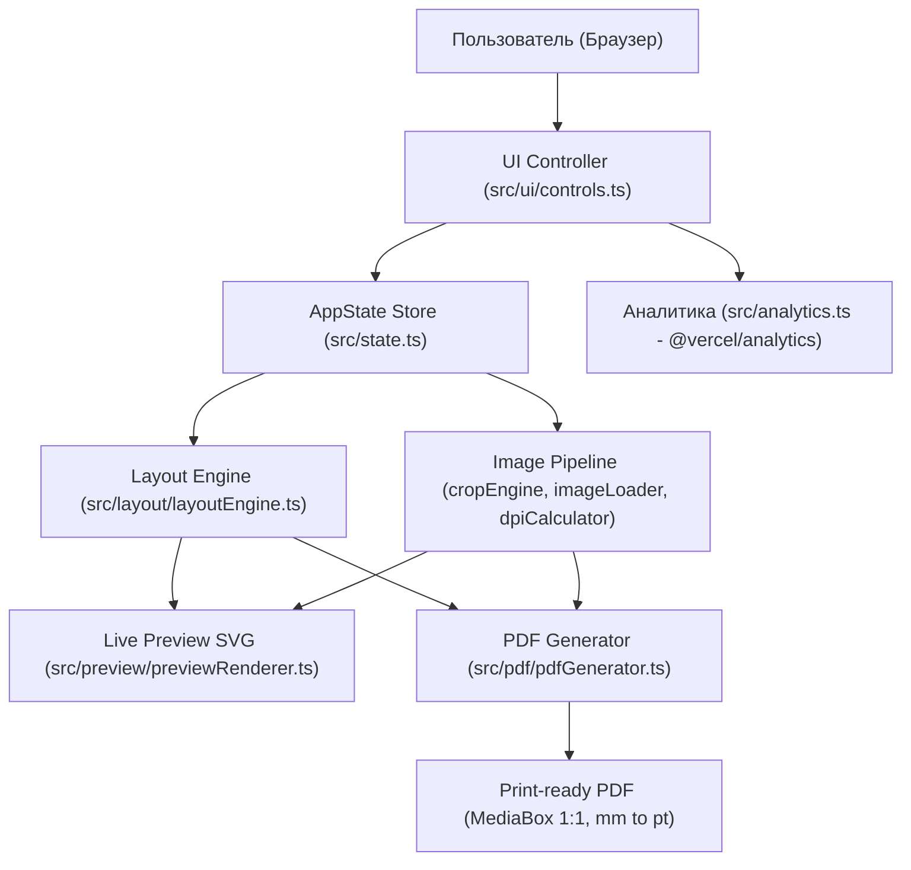

# 🔍 StickerFit: Аудит готовности к публичному запуску (Product Launch Audit)

> **Дата аудита**: Сентябрь 2026 г.  
> **Цель**: Комплексная оценка состояния репозитория `sefga/stickerfit`, фиксация baseline и классификация задач по уровням P0 / P1 / P2 перед открытием проекта для первых 100 независимых пользователей.  
> **Базовый принцип**: TRUST → CORRECTNESS → USABILITY → MEASUREMENT → DISTRIBUTION → MONETIZATION.

---

## 🗺️ 1. Архитектурная карта системы (System Architecture Map)

| Подсистема | Ключевые файлы | Назначение | Текущий статус |
|:---|:---|:---|:---:|
| **UI & Controls** | [`src/ui/controls.ts`](file:///c:/Desk/автоматизация%20разкалдки%20наклеек/src/ui/controls.ts), [`src/ui/cropDialog.ts`](file:///c:/Desk/автоматизация%20разкалдки%20наклеек/src/ui/cropDialog.ts), [`index.html`](file:///c:/Desk/автоматизация%20разкалдки%20наклеек/index.html) | Адаптивный интерфейс (десктоп/мобайл), дебаунс ввода 450мс, модалка кадрирования, Apple Help Sheet | Отлично (60 FPS, touch-friendly) |
| **State Management** | [`src/state.ts`](file:///c:/Desk/автоматизация%20разкалдки%20наклеек/src/state.ts) | Типизированное реактивное хранилище состояния приложения с сохранением в `localStorage` | Стабильно |
| **Layout Engine** | [`src/layout/layoutEngine.ts`](file:///c:/Desk/автоматизация%20разкалдки%20наклеек/src/layout/layoutEngine.ts) | Математический расчет плотной сетки на A4, оценка автоповорота на 90°, отступы и зазоры в мм | Высокая точность, 0 drift |
| **Image Pipeline** | [`src/image/imageLoader.ts`](file:///c:/Desk/автоматизация%20разкалдки%20наклеек/src/image/imageLoader.ts), [`src/image/cropEngine.ts`](file:///c:/Desk/автоматизация%20разкалдки%20наклеек/src/image/cropEngine.ts), [`src/image/dpiCalculator.ts`](file:///c:/Desk/автоматизация%20разкалдки%20наклеек/src/image/dpiCalculator.ts) | 100% клиентская нарезка на HTML5 Canvas, расчет эффективного DPI (≥300 DPI) | 100% локально, без отправки на сервер |
| **PDF Pipeline** | [`src/pdf/pdfGenerator.ts`](file:///c:/Desk/автоматизация%20разкалдки%20наклеек/src/pdf/pdfGenerator.ts), [`src/pdf/calibrationPage.ts`](file:///c:/Desk/автоматизация%20разкалдки%20наклеек/src/pdf/calibrationPage.ts) | Векторный рендеринг листа на базе `pdf-lib`, вылеты (bleed 0..3 мм), векторные метки реза, калибровочный лист | Физический масштаб 1:1 ($1\text{ mm} = 72/25.4\text{ pt}$) |
| **SEO & GEO** | [`index.html`](file:///c:/Desk/автоматизация%20разкалдки%20наклеек/index.html), [`public/robots.txt`](file:///c:/Desk/автоматизация%20разкалдки%20наклеек/public/robots.txt), [`public/sitemap.xml`](file:///c:/Desk/автоматизация%20разкалдки%20наклеек/public/sitemap.xml) | OpenGraph, Twitter Cards, Schema.org WebApplication, мультиязычные hreflang | Требует очистки от ложных данных |
| **Analytics** | [`src/analytics.ts`](file:///c:/Desk/автоматизация%20разкалдки%20наклеек/src/analytics.ts) | `@vercel/analytics` для анонимных продуктовых событий (`app_open`, `pdf_downloaded`) | 0 cookies, 0 личных данных |
| **Deployments** | `vercel.json` | 3 зеркала: Vercel (основной `stickerfit.vercel.app`), Netlify, GitHub Pages | Полная доступность |
| **Tests & Critics** | `vitest`, `scripts/*.mjs` | 15 unit-тестов Vitest, 4 скрипта Puppeteer-критики (HIG, Performance, 5-Cycles, 10-Persona) | 100% passed (Baseline зафиксирован) |

---

## 🟢 2. Что уже сделано отлично (Strong Baseline)

1. **Клиентская приватность**: Изображения наклеек обрабатываются исключительно в браузере (HTML5 Canvas). Ни одного байта пользовательских картинок не передается на сторонние серверы.
2. **Физическая точность**: Реализована строгая математика миллиметров в типографские пункты (`$pt = mm \times 72 / 25.4$`).
3. **Плавность интерфейса**: Защита от спама ререндеров через дебаунс ввода 450 мс, 0 Long Tasks при наборе текста, стабильные 60 FPS на Canvas/SVG.
4. **Полиграфические опции**: Поддержка профессиональных вылетов под обрез (Bleed: 0, 1, 2, 3 мм) и векторных меток реза (Cut marks).
5. **Мультиязычность**: Полная локализация интерфейса (Русский / Английский) с автоматическим определением языка браузера и ручным переключателем.
6. **Автоматизация контроля качества**: Пайплайн `npm run eval` запускает юнит-тесты и браузерных агентов-критиков.

---

## 🔴 3. P0 — Критические проблемы (Блокируют публичный запуск)

| Проблема | Где находится | Почему критично | Что необходимо сделать | Риск изменения |
|:---|:---|:---|:---|:---:|
| **Фиктивный `AggregateRating`** | `index.html` (Schema.org JSON-LD) | Заявлены рейтинг 4.9 и 128 отзывов при отсутствии реальной публичной базы отзывов. Поисковые системы (Google/Bing) могут наложить санкции за deceptive structured data. | **УДАЛИТЬ** блок `aggregateRating` полностью. Оставить только честные свойства `WebApplication`. | Минимальный (устраняет репутационный и SEO-риск) |
| **Противоречие в Privacy Policy** | `README.md` vs `index.html` vs `analytics.ts` | README обещает «zero tracking», но подключена Vercel Web Analytics. Несоответствие подрывает доверие технического сообщества. | Четко разделить: 1) **User Content Privacy** — изображения 100% локальны и никогда не загружаются; 2) **Product Analytics** — анонимный подсчет агрегированных событий без сбора пикселей и личных данных. | Минимальный (повышает доверие) |
| **Отсутствие файла LICENSE в корне** | Корневая директория, `package.json` | README заявляет лицензию MIT, но файла `LICENSE` в репозитории нет, а в `package.json` нет поля `"license": "MIT"`. | Добавить официальный `LICENSE` (MIT) с авторством `Mikhail Sokolskiy (sefga)` и поле `"license": "MIT"` в `package.json`. | Отсутствует |
| **Недостаточность регрессионных тестов точности печати** | `tests/` | Нет отдельного строгого сьюта тестов геометрии PDF MediaBox и крайних случаев размещения стикеров. | Создать `tests/printCorrectness.test.ts` с проверкой форматов (A4 $210 \times 297$ мм), контрольных размеров ($10 \times 10$, $25 \times 25$, $50 \times 50$, $54 \times 85$, $100 \times 100$ мм), отсутствия накопительного дрифта и инварианта «ни один стикер не выходит за printable area». | Отсутствует |

---

## 🟡 4. P1 — Желательно исправить до активного продвижения

1. **Убрать ложный московский геотаргетинг**:
   - В `index.html` удалены теги `geo.region=RU`, `geo.placename=Moscow`, координаты `ICBM`.
   - StickerFit позиционируется как глобальный инструмент (International-first Web Application).
2. **Централизация `SITE_URL`**:
   - Изолировать базовый URL в единый конфигурационный файл во избежание разрозненного хардкода при переходе на собственный домен.
3. **Стратегия честного SEO**:
   - Создать [`docs/SEO_STRATEGY.md`](file:///c:/Desk/автоматизация%20разкалдки%20наклеек/docs/SEO_STRATEGY.md) с фокусом на кластер *«A4 Sticker Sheet Maker / Print Stickers Exact Size»*.
4. **AI & Generative Engine Optimization (GEO)**:
   - Единая согласованная формулировка продукта для поисковиков и нейросетей (ChatGPT Search, Perplexity, Google SGE).
   - Информативный FAQ без спама ключевыми словами.
5. **Калибровочный эталонный лист (Golden Test)**:
   - Добавить на тестовую страницу калибровки линейку 100 мм и эталонные квадраты $50 \times 50$ и $100 \times 100$ мм.
   - Оформить документ [`docs/PRINT_ACCURACY.md`](file:///c:/Desk/автоматизация%20разкалдки%20наклеек/docs/PRINT_ACCURACY.md).
6. **Ненавязчивый канал обратной связи (Feedback Loop)**:
   - После успешного скачивания PDF показывать неблокирующий вопрос: *«Подошел ли макет для печати? [Да] [Нет]»*.
7. **GitHub как витрина первого экрана**:
   - Структурировать `README.md` по правилу 15 секунд: *Что это $\to$ Зачем $\to$ Запустить $\to$ Скриншот $\to$ 3 шага работы $\to$ Честная приватность $\to$ Возможности $\to$ Лицензия*.
8. **Community Foundation**:
   - Добавить [`CONTRIBUTING.md`](file:///c:/Desk/автоматизация%20разкалдки%20наклеек/CONTRIBUTING.md), [`SECURITY.md`](file:///c:/Desk/автоматизация%20разкалдки%20наклеек/SECURITY.md) и шаблоны Issue (включая специализированный шаблон отчета о точности печати `print_accuracy.md`).
9. **Бэклог монетизации (Backlog Only)**:
   - Создать [`docs/MONETIZATION_HYPOTHESES.md`](file:///c:/Desk/автоматизация%20разкалдки%20наклеек/docs/MONETIZATION_HYPOTHESES.md) с фиксацией гипотез (H1-H6) и критериями доказательства спроса. Никакого платного кода в проект не добавлять.

---

## ⚪ 5. P2 — Задачи для развития ПОСЛЕ первых 100 пользователей

- Сохранение пользовательских пресетов в браузере (LocalStorage Presets).
- Раскладка нескольких разных макетов стикеров на одном листе (Multi-image sheet).
- Поддержка форматов бумаги A3, Letter, рулонов плоттера.
- Пакетная выгрузка PDF (Batch export).

---

## 🚫 6. Что КАТЕГОРИЧЕСКИ НЕЛЬЗЯ делать сейчас

1. ❌ **Никаких пейволов (Paywall) и платных ограничений**: базовая раскладка и экспорт должны оставаться 100% бесплатными.
2. ❌ **Никаких аккаунтов, паролей и обязательной регистрации**: пользователь должен получать готовый PDF за 30–60 секунд с момента первого визита.
3. ❌ **Никакой интеграции со Stripe / платежными шлюзами**: до подтверждения готовности людей платить платежный код будет лишним балластом.
4. ❌ **Никакого облачного хранения пользовательских картинок**: это увеличивает затраты на сервера и разрушает главное преимущество конфиденциальности.
5. ❌ **Никаких обучающих экранов-стен (Onboarding Wall)**, мешающих мгновенному доступу к функционалу.

---

## 📊 7. Фиксация Baseline метрик

| Метрика | Значение Baseline |
|:---|:---:|
| **Unit-тесты (Vitest)** | 15 из 15 пройдены (3 тест-файла, ~1.18 сек) |
| **Аудит Apple HIG** | 100 / 100 баллов |
| **Аудит скорости ввода** | 0 Long Tasks при наборе, дебаунс 450 мс |
| **5 циклов UX-аудита** | 100 / 100 баллов |
| **10 персонажей-критиков** | 100 / 100 баллов |
| **Размер бандла (gzip JS)** | ~213 Кб |
| **Размер бандла (gzip CSS)** | ~5.7 Кб |
| **Время загрузки первого экрана** | < 0.3 сек |

---

## 🏁 Вывод аудита
Текущая кодовая база обладает исключительной инженерной устойчивостью. Основные преграды к публичному запуску лежат не в алгоритмах раскладки, а в **честности позиционирования (Trust)**, **официальном юридическом оформлении (License)**, **неоспоримых тестах точности печати (Print Correctness)** и **международном фокусе без локального спама**.

Приступаем к реализации P0 изменений.
